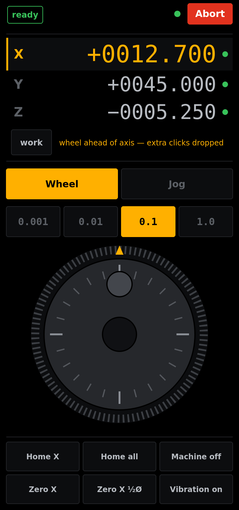
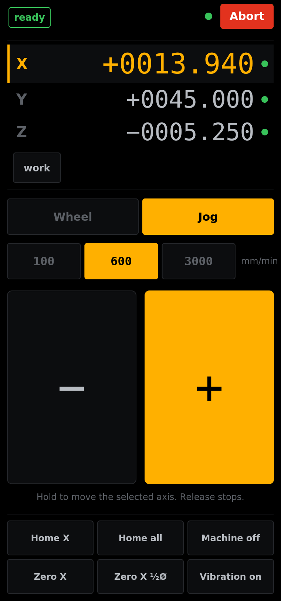
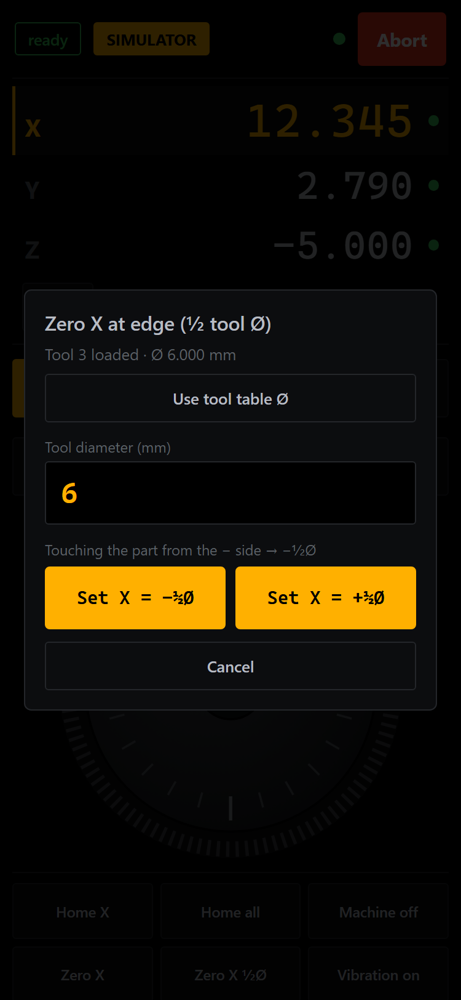
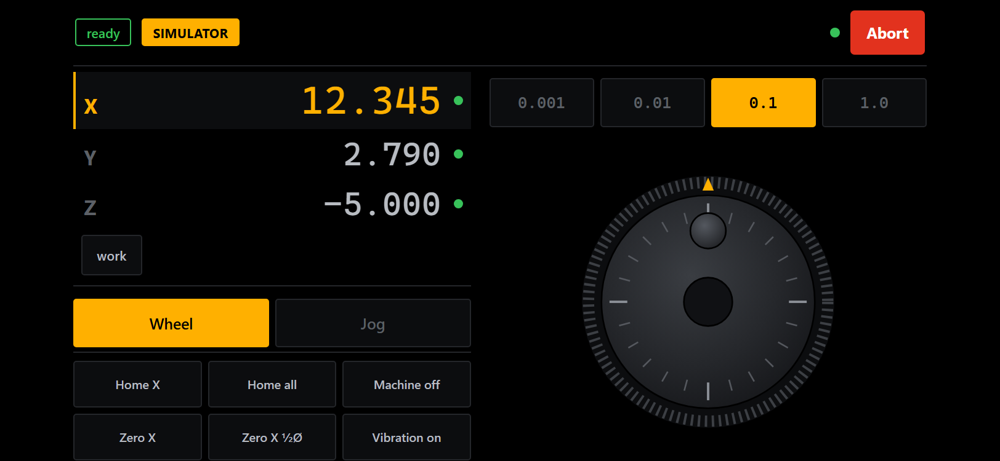
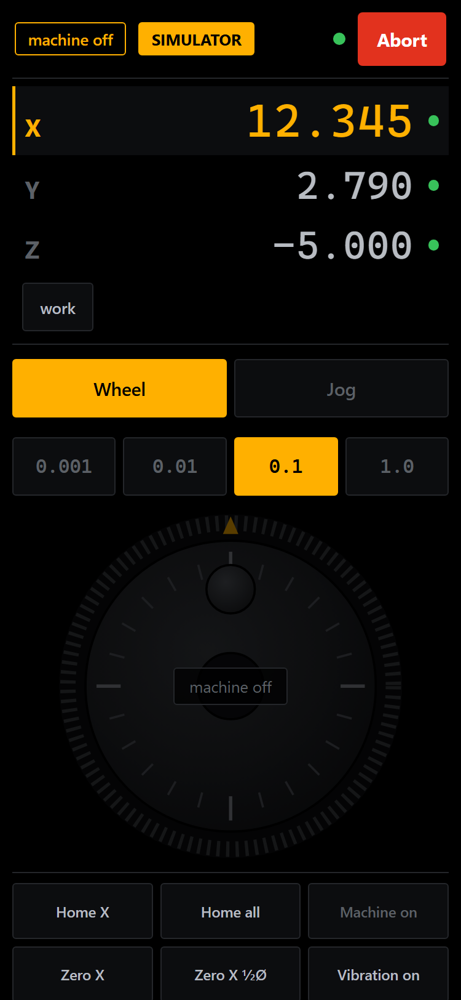

# linuxcnc-web — phone MPG pendant

A fork of [multigcs/linuxcnc-web](https://github.com/multigcs/linuxcnc-web) that adds a
touch jog pendant for your phone: a detented virtual handwheel with haptic clicks, a
hold-to-jog mode, and DRO touch-off tools — served straight from the LinuxCNC machine
over shop Wi-Fi. The original web frontend still lives at `/` (with a few fixes, see
*Changes to the upstream UI*); the pendant is a self-contained blueprint at `/mpg/`.

<p align="center">
  
  
  
</p>

*The jog-mode screenshot shows the earlier two-button layout; jog mode now has six
arrows (X/Y cross, Z pair).*

## Features

- **MPG wheel** — 24 detents per revolution, one vibration tick per detent
  (Android; iOS Safari has no vibration API). Step sizes 0.001 / 0.01 / 0.1 / 1.0 mm
  per click. Detents become bounded `JOG_INCREMENT` moves, batched every 60 ms.
- **Lead cap** — the wheel is never allowed to run more than a few increments
  (max 2 mm) ahead of the axis. Spin faster than the machine can follow and extra
  clicks are dropped, with a note on screen. A network stall can never store up
  surprise motion.
- **Jog mode** — six hold-to-move arrows (an X/Y cross and a Z up/down pair) at
  100 / 600 / 3000 mm/min, with a
  **server-side deadman**: the page sends a keepalive every 150 ms and the server
  stops the jog itself after 0.4 s of silence (Wi-Fi drop, app killed, phone died).
- **DRO** — work / machine coordinates, per-axis homed indicators, tap a row to
  select the axis.
- **Touch-off** — plain zero (`G10 L20`) and **edge zero at ± half tool diameter**,
  with the diameter pre-filled from the LinuxCNC tool table when a tool is loaded.
- **Interlocks** — jogging is refused server-side while a program is running, in
  e-stop, or with the machine off. Joint jog before homing, world-axis jog after.
- **Machine controls** — home axis / home all, machine on/off, abort.
- **Fits any phone** — the whole UI scales from the viewport (no scrolling), with a
  two-column landscape layout. Settings persist on the phone.
- **Built-in simulator** — on a Windows or macOS PC (or anywhere with `MPG_SIM=1`)
  the backend runs a simulator, so the full UI can be tried before it ever touches
  the machine. On Linux a missing `linuxcnc` module is a start-up error, never a
  silent simulation — a pendant that only pretends to zero an axis is dangerous.

<p align="center">
  
  
</p>

## Requirements

- LinuxCNC 2.9 or newer — the pendant and the upstream code are Python 3, and the
  `linuxcnc` Python module of LinuxCNC 2.8 is Python-2-only
- Python 3 and Flask on the machine PC — on the Debian-based LinuxCNC images:
  `sudo apt install python3-flask`
- A phone with a modern browser on the same network

## Install on the CNC machine

```sh
git clone https://github.com/Coffee0297/linuxcnc-web.git
cd linuxcnc-web
# LinuxCNC must already be running (see below)
flask run --host=0.0.0.0
```

`--host=0.0.0.0` matters — without it Flask only listens on localhost and the phone
can't connect. Then open **`http://<cnc-ip>:5000/mpg/`** on the phone (the original
frontend is at `http://<cnc-ip>:5000/`). Add it to the home screen for quick access,
and raise the phone's screen timeout — the Wake Lock API needs HTTPS, which a plain
LAN server doesn't have.

Start LinuxCNC first. The full app (`app.py`) also loads the upstream `api`/`client`
blueprints, which connect to LinuxCNC at import time and fail if it is not running.
Only `standalone_mpg.py` (below) can be started beforehand: the pendant then shows
*waiting for LinuxCNC* and connects by itself once it's up.

All speeds and step sizes are machine units — the pendant assumes a metric (mm)
config; on an inch machine the same numbers are inches.

The pendant maps axis letters to joint numbers 1:1 (X→0, Y→1, Z→2), i.e. it is
written for trivkins XYZ machines with one motor per axis. On other kinematics
(gantry, lathe) it detects the mismatch and refuses joint-mode jogs and per-axis
homing — see the Safety model.

To start the server at boot, a minimal systemd unit (it simply retries every 5 s
until LinuxCNC is up)
(`/etc/systemd/system/linuxcnc-web.service`):

```ini
[Unit]
Description=linuxcnc-web pendant
After=network.target

[Service]
User=<your-user>
WorkingDirectory=/home/<your-user>/linuxcnc-web
ExecStart=/usr/bin/flask run --host=0.0.0.0
Restart=always
RestartSec=5

[Install]
WantedBy=multi-user.target
```

then `sudo systemctl enable --now linuxcnc-web`.

## Try it without a machine

```sh
pip install flask
python standalone_mpg.py             # Windows / macOS: simulator starts automatically
MPG_SIM=1 python standalone_mpg.py   # Linux: simulate only when asked
```

runs only the pendant with the built-in simulator (fake XYZ axes and a Ø6 mm tool 3
in the "tool table"). Open `http://<pc-ip>:5000/mpg/` on the phone to feel the wheel,
the vibration, and the whole workflow safely.

## Using it

Tap a DRO row to select the axis; the `work` chip toggles work/machine coordinates.
In **Wheel** mode pick a step size and turn — each detent is one increment. In
**Jog** mode pick a speed and hold an arrow: the cross moves X and Y, the pair on the
right moves Z up and down; release stops. **Zero X** sets the work
offset of the selected axis to zero at the current position.

**Zero X ½Ø** is edge finding: jog until the tool touches the part edge, tap it, and
confirm the tool diameter (taken from the tool table if available). *Touching from
the − side → "Set X = −½Ø"*, and the edge itself becomes zero. Nothing moves — it
only writes the work offset. Glance at the DRO afterwards: if the sign is opposite
to what you expect, you picked the wrong side button.

## Safety model — read once

- **The phone is not an e-stop.** The wired e-stop chain remains the only safety
  device. Abort sends task-abort + jog-stop, nothing more.
- **Machine on** also sends an e-stop reset; LinuxCNC only leaves e-stop if the
  hardware chain allows it.
- Continuous jog stops on its own within ~0.4 s if the connection dies. Verify it
  once on your machine: hold a jog, flip the phone to flight mode, watch the axis
  stop.
- The page treats 1.5 s of silence on the status stream as a lost link: it releases
  a held jog client-side and greys out. The server-side 0.4 s deadman is unchanged.
- The stop of every held jog is checked. If LinuxCNC does not acknowledge it within
  0.5 s the server also sends a task abort and the phone shows *jog stop failed -
  abort sent*.
- Start and stop requests carry a sequence number, so a stop that overtakes its own
  start on the network can never leave a jog running unwatched.
- Until every joint is homed, continuous jog speed is capped at 600 mm/min
  (`UNHOMED_MAX_MM_MIN`) — unhomed joints have no soft limits.
- **Machine on**, **Home X** and **Home all** need a 0.6 s hold, not a tap; a short
  tap says *hold to confirm*. Wheel and jog requests that waited more than 0.5 s
  for their turn on the server are dropped rather than applied late.
- Zero refuses while an axis is still moving. Wheel clicks that waited more than
  0.3 s behind a stalled link are discarded, never replayed, and the axis or step
  cannot be changed while a finger is on the wheel.
- Joint-mode jogging (before homing) and per-axis homing are refused on machines
  whose axis letters do not map 1:1 to joints (gantry XYYZ, lathe XZ): use
  **Home all**, then jog in world mode.
- The pendant does not read the LinuxCNC error channel by default: it is a queue, so
  a message shown on the phone would be taken away from AXIS or gmoccapy at the
  machine. Set `MPG_ERRORS=1` to get error toasts when the phone is the only GUI.
- Keep the server on the shop LAN only. It has **no authentication** and it moves a
  machine — never port-forward or expose it to the internet.

## Tuning

| Where | What |
|---|---|
| `mpg/mpg.py` (top) | `AXES` (add `"a"` for a 4th axis — the DRO and wheel follow; the jog arrows cover X/Y/Z), `CONT_TIMEOUT` deadman timeout, `MAX_LEAD_FACTOR` / `MAX_LEAD_MM` wheel lead cap, `UNHOMED_MAX_MM_MIN` speed cap before homing, poll/SSE rates. Environment: `MPG_SIM=1` simulator, `MPG_ERRORS=1` error toasts |
| `mpg/static/mpg.js` (top) | `DETENT_DEG` detents per revolution (also drives the tick marks on the wheel), `WHEEL_FEED` wheel feed rate, `KEEPALIVE_MS` keepalive interval — keep it well under `CONT_TIMEOUT` |
| `mpg/templates/mpg.html` | the step-size and jog-speed button values |

## Troubleshooting

- *No error toasts on the phone* — by design (see Safety model); start with
  `MPG_ERRORS=1` if the phone is the only GUI in use.
- *"joint jog refused"* — this machine's joints are not a plain XYZ mapping; press
  **Home all**, then jog in world mode.
- *waiting for LinuxCNC* — LinuxCNC isn't running on this PC, or the app was started
  by a different user than LinuxCNC (NML needs the same environment).
- *Phone can't connect* — Flask started without `--host=0.0.0.0`, or a firewall on
  the machine PC is blocking port 5000.
- *"jog not allowed"* — a program is running, e-stop is active, or the machine is
  off; the interlock is server-side and deliberate.
- *Wheel drops clicks on fast spins* — that's the lead cap doing its job; raise
  `MAX_LEAD_FACTOR` and/or `MAX_LEAD_MM` in `mpg/mpg.py` if you want more run-ahead
  (the 2 mm cap is what limits the 1.0 mm step to two clicks of lead). An earlier
  floating-point bug that dropped detents even at slow speeds has been fixed.
- *No vibration* — iPhones don't expose a vibration API to the browser; on Android
  make sure the Vibration toggle on the page is on.

## How it works

One Flask blueprint (`mpg/`) does everything: a poll loop reads LinuxCNC status via
NML at 20 Hz and streams it to the page over Server-Sent Events at 10 Hz; commands
go back as small JSON POSTs. Wheel detents become bounded incremental jogs, held
buttons become continuous jogs guarded by a watchdog thread, and touch-off runs
`G10 L20` through a brief MDI round-trip. No websockets, no build step, no
dependencies beyond Flask. The screenshots in `images/` are design renders generated
from the stylesheet.

## Changes to the upstream UI

The original page at `/` is mostly as upstream left it, with these fixes:

- Vue is served locally, so the page works offline (no CDN needed on the shop LAN).
- The upload only accepts `.ngc`/`.nc` files with safe filenames, and the
  loaded-file URL parameter is limited to the upload folder.
- The rs274 preview call is no longer built with a shell, and the G-code listing is
  HTML-escaped.
- The leftover debug routes `/mdi`, `/start`, `/spindle`, `/homeing` and `/view` were
  removed.
- The spindle ↶ / STOP / ↷ buttons now work: STOP is spindle off; ↶ / ↷ start at
  the last programmed S, else at 1 rpm like AXIS.
- The MDI history keeps the 10 most recent commands; MDI text is URL-encoded and
  refusals are shown next to the Go button.
- A red banner appears when the page loses the server, instead of the DRO silently
  freezing on old values.
- Still as upstream: the jog buttons on this page have no server-side dead-man and
  always request joint-jog mode. Use the pendant for jogging.
- Still as upstream: while this page is open it reads the LinuxCNC error channel for
  its error list, which takes those messages away from AXIS or gmoccapy. Close it
  when AXIS is the operator GUI.
- Jog buttons stop when the pointer leaves them.

These upstream-side changes could not be run against a real machine — try them once
with the e-stop within reach.

## Credits & license

Built on [linuxcnc-web](https://github.com/multigcs/linuxcnc-web) by Oliver Dippel
(multigcs). GPL-2.0, same as upstream — see `LICENSE`.
